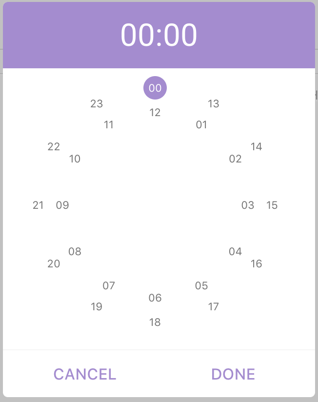
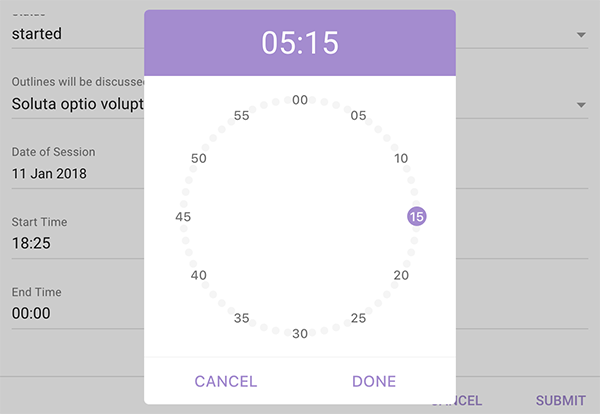

# Vue2 Clock Picker

A simple clock picker component for `vue v2.x`.





### Installation

```
$ npm install @pencilpix/vue2-clock-picker --save
```
or

```
$ yarn add @pencilpix/vue2-clock-picker
```

  - __In Browser:__
    1. via plugin
    ```html
    <link href="node_modules/@pencilpix/vue2-clock-picker/dist/vue2-clock-picker.min.css"/>


    <script src="node_modules/vuejs/dist/vue.min.js"></script>
    <!-- plugin will register the component globally in the global vue instance -->
    <script src="node_modules/@pencilpix/vue2-clock-picker/dist/vue2-clock-picker.plugin.js"></script>


    <!-- if for any reason need to install the plugin manually -->
    <script>
    Vue.use(VueClockPickerPlugin) // since the plugin is globally available
    </script>
    ```

    2. via per component
    ```html
    <link href="node_modules/@pencilpix/vue2-clock-picker/dist/vue2-clock-picker.min.css"/>


    <script src="node_modules/vuejs/dist/vue.min.js"></script>
    <script src="node_modules/@pencilpix/vue2-clock-picker/dist/vue2-clock-picker.js"></script>
    <script>
      const app = new Vue({
        // ...
        components: {
          VueClockPicker, //  bundle makes the component globally available for registering
        },
        // ...
      });
    </script>
    ```

  - __Module:__
      1. per component
      ```js
      import VueClockPicker from '@pencilpix/vue2-clock-picker';
      import '@pencilpix/vue2-clock-picker/dist/vue2-clock-picker.min.css';

      export default {
        // ...
        components: {
          VueClockPicker,
        }
        // ...
      }

      ```

      2. global plugin
      ```js
      import '@pencilpix/vue2-clock-picker/dist/vue2-clock-picker.min.css';
      const VueClockPickerPlugin = require('@pencilpix/vue2-clock-picker/dist/vue2-clock-picker.plugin.js')
      Vue.use(VueClockPickerPlugin)
      ```

### Usage

once component is installed it can be used as:

```html
<vue-clock-picker v-model="value"></vue-clock-picker>
```


#### props

prop           | type         | default
---------------|--------------|-------------
id             | `String`     | input id and label for value. default is randomly unique like: `clock_picker_input_jj17bvjklhwhxvm`
placeholder    | `String`     | input placeholder default `''`
name           | `String`     | input name default `''`
label          | `String`     | label text will be hidden if not set. default `''`
input-class    | `String`     | css custom class to be applied to input. default `clock-picker__input`.
input-container-class | `String`| css custom class to be applied to input container. default `clock-picker__input-container`.
input-value-class | `String`| css custom class to be applied to input container when input contains value. default `clock-picker__input--has-value`.
input-focus-class | `String` | css custom class to be applied to input container when the input is focused. default `clock-picker__input--focused`.
input-error-class | `String` | css custom class to be applied to input container when the value not match `HH:MM` or the input is required and the value is empty. default `clock-picker__input--error`.
label-class       | `String | custom class name of label. default: `clock-picker__label`
value                 | `String` | initial value of input. default `''`
required              | `Boolean` | set it to true if time field is required. default `false`
disabled-from         | `String` | value of time to disable from until `disabled-to` value or to the end. default `null`.
disabled-to           | `String` | value of time to disable from `disabled-to` time value or from 00:00 to, default `null`.
done-text             | `String` | done button text, default `done`.
cancel-text           | `String` | cancel button text, default `cancel`.
active-color          | `String` | active value bg color, header of dialog bg, center color and line color. Default: `#a48bd1`.
active-text-color     | `String` | active value color and actions color. default: `white`.
color                 | `String` | regular text color. default: `#757575`.
disabled-color         | `String` | disabled actions and values color, default: `#ddd`.
close-on-esc           | `Boolean` | enable close on `ESC` key press, default `false`.
close-on-overlay       | `Boolean` | enable closing dialog on overlay click, default `false`.
font                   | `String`  | font family used in canvas, default `Roboto, arial, san-serif`


#### events

event           | when
----------------|--------------
beforeOpen      | just before opening the dialog.
open            | just after opening the dialog.
beforeClose     | just before closing the dialog.
close           | just after closing the dialog.
timeset         | after the value of input is set. and it will recieve the value as `01:02`
cancel          | when cancel dialog button is clicked and it will receive the value found at cancel time.


#### methods

method     | behavior
-----------|-----------
open       | open the dialog
close      | close the dialog
getValue   | return the current value of the input as `02:00`
setValue   | set the current value of input and it accept `String` with valid time `HH:MM`
validate   | check for errors. it can be used just before submit the form.

